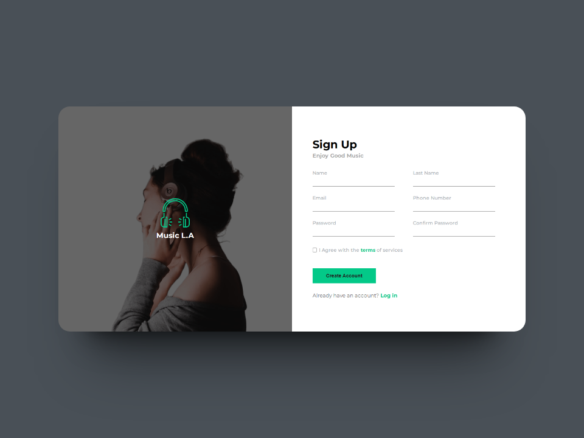

# Sign-Up-Form - Web Development Challenge by The Odin Project

## Table of contents

- [Sign-Up Form - Web Development Challenge by The Odin Project](#Sign-Up-Form-web-development-challenge-by-The-Odin-Project)
  - [Table of contents](#table-of-contents)
  - [Overview](#overview)
    - [Screenshot](#screenshot)
    - [Links](#links)
  - [My process](#my-process)
    - [Built with](#built-with)
    - [What I learned](#what-i-learned)
    - [What I learned](#what-i-learned-1)
      - [HTML5](#html5)
      - [CSS](#css)
      - [JavaScript](#javascript)
  - [Author](#author)


## Overview

### Screenshot



### Links

- Solution URL: [Github](https://github.com/deividcode/sign-up-form)
- Live Site URL: [Github Page](https://deividcode.github.io/sign-up-form/)

## My process

### Built with

- Semantic HTML5 markup
- CSS custom properties
- Flexbox
- CSS Grid
- Mobile-first workflow

### What I learned

In the process of developing this website I learned some new things for me.

### What I learned

#### HTML5

```html
<!-- Establecer los atributos for, name, id para una mejor comprension y guia del navegador -->
  <label for="lastname" class="label-signUp">
    Last Name
    <input required pattern="[A-Za-z]" type="text" name="lastname" id="lastname" class="input-signUp">
  </label>
```

#### CSS

```css
  /* Seleccionar Labels o Forms por sus atributos */

  label[for="terms"] {    
  } 
  input[name="name"] {    
  } 
```

## Author

- Twitter - [@deividCoder](https://twitter.com/deividCoder)
